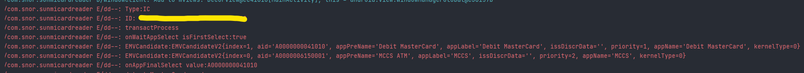
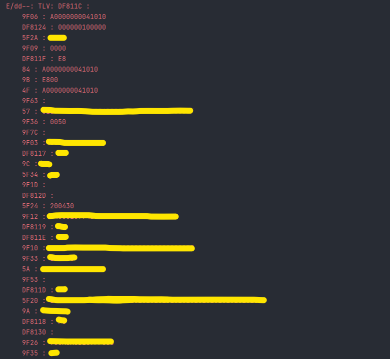

# Sunmi-Card-Reader

# ⚠️ Update (20-Oct-2022)
Is been awhile since last update, there still a lot of learning waiting for me, will update some doc regrading what i learn once i free, but if you want immediate answer feel free to contact me.

## 📝 Side note

I discovered that there are several names for this, such as Sunmi Card Reader, Sunmi Pay Library, Sumni Pay Service, Sunmi SDK. I don't care what you call it, all i want to do is demonstrate and show how to use the sdk, as their website is basically a trash and donesn't include much information even on the internet.
</br>

## 📱 Device Tested

- Sunmi P2

</br>

## 📂 Preparation

Before we start, make sure you have import `PayLib-release-1.4.43.aar` library to your project and remember to copy all those thing in `Callback` and `util` folder (Just do it).

</br>

## ⚙ Manifest

Make sure you've enabled all of the permissions on the `Manifest`

```bash
    <uses-permission android:name="com.sunmi.perm.MSR" />
    <uses-permission android:name="com.sunmi.perm.ICC" />
    <uses-permission android:name="com.sunmi.perm.PINPAD" />
    <uses-permission android:name="com.sunmi.perm.SECURITY" />
    <uses-permission android:name="com.sunmi.perm.CONTACTLESS_CARD" />
```

## Init SDK

```bash
    var mSMPayKernel: SunmiPayKernel? = null
    mSMPayKernel = SunmiPayKernel.getInstance()
    mSMPayKernel!!.initPaySDK(this,object : SunmiPayKernel.ConnectCallback {
        override fun onDisconnectPaySDK() {}
        override fun onConnectPaySDK() {
             try {
                BaseApp.mReadCardOptV2 = mSMPayKernel!!.mReadCardOptV2
                BaseApp.mEMVOptV2 = mSMPayKernel!!.mEMVOptV2
                BaseApp.mPinPadOptV2 = mSMPayKernel!!.mPinPadOptV2
                BaseApp.mBasicOptV2 = mSMPayKernel!!.mBasicOptV2
                BaseApp.mSecurityOptV2 = mSMPayKernel!!.mSecurityOptV2
            } catch (e: Exception) {
                e.printStackTrace()
            }
        }
    })
```

Before we start scaning the card we have to init for the EMV process (Just copy from the repo), it's for init for AID(Application Identifiers), CAPK (CA Public Key) and terminal config

```bash
    EmvUtil().init()
```

Note: Every country have different format, Im not really sure either.

</br>

## 😒 Here is where pain started

Here's a function to get things started.

```bash
private fun checkCard(cardType: Int) {
    try {
        mEMVOptV2.abortTransactProcess()
        mEMVOptV2.initEmvProcess()

        mReadCardOptV2.checkCard(cardType, mCheckCardCallback, 60)
    } catch (e: Exception) {
        e.printStackTrace()
    }
}
```

To call the function is pretty easy

```bash
binding.btnNFC.setOnClickListener {
    val type = AidlConstants.CardType.NFC.value
    checkCard(type)
}
```

or any other value

```bash
val type = AidlConstants.CardType.IC.value
        # or
val type = AidlConstants.CardType.MAGNETIC.value or 
                AidlConstants.CardType.NFC.value or 
                AidlConstants.CardType.IC.value
```

After you calling it the result will return on `mCheckCardCallback`.

```bash
private val mCheckCardCallback: CheckCardCallbackV2 = object : CheckCardCallback() {
    override fun findICCard(atr: String) {
        super.findICCard(atr)   
        Log.e("dd--", "ID: $atr")
    }
    override fun findMagCard(info: Bundle) {
        super.findMagCard(info)
        val track2 = info.getString("TRACK2")
        Log.e("dd--", "Track 2: $track2")
    }
    override fun findRFCard(uuid: String) {
        super.findRFCard(uuid)
        Log.e("dd--", "ID: $uuid")
    }
    ....
}

```

And that's it for the card reader.

</br>

## EMV Process

There only two place we need to use this process which is NFC or IC because magnatic stripes will direct give you the raw value of the card info.

At start we calling this function on `findICCard` and `findRFCard`

```bash
private fun transactProcess() {
    Log.e("dd--", "transactProcess")
    try {
        val emvTransData = EMVTransDataV2()
        emvTransData.amount = "10"
        emvTransData.flowType = 1 //1 Standard Flow, 2 Simple Flow, 3 QPass
        emvTransData.cardType = mCardType
        mEMVOptV2.transactProcess(emvTransData, mEMVCallback)
    } catch (e: Exception) {
        e.printStackTrace()
    }
}

```

Only 2 value u might need to change like `amount` (cent) and `cardType` (either NFC/IC)</br>
And same thing as card reading the result will be return on `mEMVCallback`

```bash
private val mEMVCallback = object : EMVCallback(){

    override fun onWaitAppSelect(p0: MutableList<EMVCandidateV2>?, p1: Boolean) {}

    override fun onAppFinalSelect(p0: String?) {}

    override fun onConfirmCardNo(p0: String?) {}

    override fun onRequestShowPinPad(p0: Int, p1: Int) {}

    override fun onCertVerify(p0: Int, p1: String?) {}

    override fun onOnlineProc() {}

    override fun onTransResult(p0: Int, p1: String?) {}
        
} 

```

Here is where thing will becoming complicated, i will try explain whatever i found. (Judge me if im wrong)

</br>

### 🕐Step 1

</br>

```bash
override fun onWaitAppSelect(p0: MutableList<EMVCandidateV2>?, p1: Boolean) {
    super.onWaitAppSelect(p0, p1)

    Log.e("dd--", "onWaitAppSelect isFirstSelect:$p1")
    p0?.forEach {
        Log.e("dd--", "EMVCandidate:$it")
    }
    mEMVOptV2.importAppSelect(0)
}

```

Nothing will happen here unless you are plugging in a `Debit Card`, because in debit card there will two AID(Candidate) inside the card. One will be the "Card" for us to procced and another one is for the ATM.



But normally the card we need is always the first index (0), so we have to tell the SDK which are we select and notify to procced to next step.

```bash
mEMVOptV2.importAppSelect(0)
```

### 🕑Step 2

Set the normal TLV Data before we start checking the card prefix

```bash
override fun onAppFinalSelect(p0: String?) {
    super.onAppFinalSelect(p0)
    Log.e("dd--", "onAppFinalSelect value:$p0")

    val tags = arrayOf("5F2A", "5F36", "9F33", "9F66")
    val value = arrayOf("0458", "00", "E0F8C8", "B6C0C080")
    mEMVOptV2.setTlvList(TLVOpCode.OP_NORMAL, tags, value)
}

```

## ⚠⚠ Important Note ⚠⚠ </br>

`5F2A` = country code </br>
`5F36` = currency code exponent </br>
Please refer this [EFTLAB](https://www.eftlab.com/knowledge-base/145-emv-nfc-tags/) </br></br>

(Side Note: I legit don't know what should i assign for `5F36` even the official document didn't state is `00` or  `02` mean 2 decimal point.)</br></br>


```bash
override fun onAppFinalSelect(p0: String?) {
    super.onAppFinalSelect(p0)

    ...

    if (p0 != null && p0.isNotEmpty()){
        val isVisa = p0.startsWith("A000000003")
        val isMaster = (p0.startsWith("A000000004") || p0.startsWith("A000000005"))

    }
}

```

So here we are checking which type are them but in this case i just going for Visa and Master Card, but if you want other prefix please refer to [this](https://en.wikipedia.org/wiki/EMV#Application_selection)

```bash
val isUnionPay = p0.startsWith("A000000333")
val isAmericanExpress = p0.startsWith("A000000025")
val isJCB = p0.startsWith("A000000065")
val isRuPay = p0.startsWith("A000000524")
```

Still inside `onAppFinalSelect` after checking with the prefix and now we have to set the other TLV value.


```bash
if (isVisa){

    // VISA(PayWave)
    Log.e("dd--", "detect VISA card")

}else if(isMaster){

    // MasterCard(PayPass)
    Log.e("dd--", "detect MasterCard card")
    val tagsPayPass = arrayOf(
        "DF8117", "DF8118", "DF8119", "DF811B", "DF811D",
        "DF811E", "DF811F", "DF8120", "DF8121", "DF8122",
        "DF8123", "DF8124", "DF8125", "DF812C"
    )
    val valuesPayPass = arrayOf(
        "E0", "F8", "F8", "30", "02",
        "00", "E8", "F45084800C", "0000000000", "F45084800C",
        "000000000000", "999999999999", "999999999999", "00"
    )
                    
    mEMVOptV2.setTlvList(TLVOpCode.OP_PAYPASS, tagsPayPass, valuesPayPass)

    //Reader CVM Required Limit (Malaysia => RM250)
    mEMVOptV2.setTlv(TLVOpCode.OP_PAYPASS,"DF8126","000000025000")

}                
```

### 📒Side Note

`DF8126` -> Reader CVM Required Limit </br>


</br>

For `AmericanExpress`

```bash
val tags = arrayOf("9F6D", "9F6E", "9F33", "9F35", "DF8168", "DF8167", "DF8169", "DF8170")
val values = arrayOf("C0", "D8E00000", "E0E888", "22", "00", "00", "00", "60")
```

And in the end, same thing to notify the SDK.

```bash
mEMVOptV2.importAppFinalSelectStatus(0)
```

</br>

### 🕒Step 3

Nothing much on `onConfirmCardNo` it will only show you the card number

```bash
override fun onConfirmCardNo(p0: String?) {
    super.onConfirmCardNo(p0)
    Log.e("dd--", "onConfirmCardNo cardNo:$p0")
    mCardNo = p0!!
    //notify sdk        
    mEMVOptV2.importCardNoStatus(0)
}
```

</br>

### 🕓Step 4

In `onRequestShowPinPad` it will prompt pin pad for user to input the pin.

```bash
override fun onRequestShowPinPad(p0: Int, p1: Int) {
    super.onRequestShowPinPad(p0, p1)
    Log.e("dd--", "onRequestShowPinPad pinType:$p0 remainTime:$p1")
    // 0 - online pin, 1 - offline pin
    mPinType = p0
    initPidPad()
}
```

On `initPidPad()`

```bash
private fun initPidPad(){
    Log.e("dd--", "initPinPad")
    try {
        val pinPadConfig = PinPadConfigV2()
        pinPadConfig.pinPadType = 0
        pinPadConfig.pinType = mPinType!!
        pinPadConfig.isOrderNumKey = true
        val panBytes = mCardNo.substring(mCardNo.length - 13, mCardNo.length - 1)
                .toByteArray(charset("US-ASCII"))
        pinPadConfig.pan = panBytes
        pinPadConfig.timeout = 60 * 1000 // input password timeout
        pinPadConfig.pinKeyIndex = 12 // pik index 
        pinPadConfig.maxInput = 6
        pinPadConfig.minInput = 0
        pinPadConfig.keySystem = 0 
        pinPadConfig.algorithmType = 0 
        mPinPadOptV2.initPinPad(pinPadConfig, mPinPadCallback)
    } catch (e: Exception) {
        e.printStackTrace()
    }
}
```

⚠ Few thing need you need to pay attention about he pin pad config. </br>
`pinType` 0 = online pin , 1 = offline pin </br>
`algorithmType` 0 = 3DES , 1 = SM4 </br>
`keySystem` 0 = SEC_MkSk , 1 = SEC_DuKpt </br>
</br>
If your pin block return you `00` try to change `pinKeyIndex` until where is works. I legit don't know what this thing do if anyone count help me explain.
</br>

</br>
Same thing result will return on `mPinPadCallback`

```bash
private val mPinPadCallback = object: PinPadCallback(){

    override fun onConfirm(p0: Int, p1: ByteArray?) {
        super.onConfirm(p0, p1)
        if (p1 != null) {
            val hexStr = ByteUtil.bytes2HexStr(p1)
            Log.e("dd--", "onConfirm pin block:$hexStr")
            importPinInputStatus(0)
        }else{
            importPinInputStatus(2)
        }
    }

    override fun onCancel() {
        super.onCancel()
        Log.e("dd--", "onCancel")
        importPinInputStatus(1)
    }

    override fun onError(p0: Int) {
        super.onError(p0)
        Log.e("dd--", "onError: ${AidlErrorCode.valueOf(p0).msg}")
        importPinInputStatus(3)
    }

}
```

After user done input the pin if successful it will generate the pin block and same thing we have to notify the SDK what is the status.

```bash
private fun importPinInputStatus(inputResult: Int) {
    Log.e("dd--", "importPinInputStatus:$inputResult")
    try {
        mEMVOptV2.importPinInputStatus(mPinType!!, inputResult)
    } catch (e: Exception) {
        e.printStackTrace()
    }
}
```

We almost there, don't worry.

</br>

### 🕔Step 5

I legit don't know what this thing do (`onCertVerify`).

```bash
override fun onCertVerify(p0: Int, p1: String?) {
    super.onCertVerify(p0, p1)
    Log.e("dd--", "onCertVerify certType:$p0 certInfo:$p1")
    mCertInfo = p1.toString()
    mEMVOptV2.importCertStatus(0)
}
```

### 🕕Step 6

On this step, we almost there and here we gonna pull all the data (TLV data) inside the chip. (as long is not Magnetic Strip Card)

```bash
override fun onOnlineProc() {
    super.onOnlineProc()
    Log.e("dd--", "onOnlineProc")
    try{

        if(mCardType != AidlConstants.CardType.MAGNETIC.value){
            getTlvData()
        }
        importOnlineProcessStatus(0)

    }catch (e:Exception){
        e.printStackTrace()
        importOnlineProcessStatus(-1)
    }
}
```

```bash
private fun getTlvData() {
    try {
        val tagList = arrayOf(
            "DF02", "5F34", "9F06", "FF30", "FF31",
            "95", "9B", "9F36", "9F26", "9F27", 
            "DF31", "5A", "57", "5F24", "9F1A", 
            "9F03", "9F33", "9F10", "9F37", "9C",
            "9A", "9F02", "5F2A", "82", "9F34", 
            "9F35", "9F1E", "84", "4F", "9F09", "9F41",
            "9F63", "5F20", "9F12", "50"
        )
        //Only Mastercard have this extra tag
        val payPassTags = arrayOf(
                "DF811E",
                "DF812C",
                "DF8118",
                "DF8119",
                "DF811F",
                "DF8117",
                "DF8124",
                "DF8125",
                "9F6D",
                "DF811B",
                "9F53",
                "DF810C",
                "9F1D",
                "DF8130",
                "DF812D",
                "DF811C",
                "DF811D",
                "9F7C"
        )
        val outData = ByteArray(2048)
        val map: MutableMap<String, TLV> = HashMap()
        var len = mEMVOptV2.getTlvList(TLVOpCode.OP_NORMAL, tagList, outData)
        if (len > 0) {
            val hexStr = ByteUtil.bytes2HexStr(Arrays.copyOf(outData, len))
            map.putAll(TLVUtil.hexStrToTLVMap(hexStr))
        }
        len = mEMVOptV2.getTlvList(TLVOpCode.OP_PAYPASS, payPassTags, outData)
        if (len > 0) {
            val hexStr = ByteUtil.bytes2HexStr(Arrays.copyOf(outData, len))
            map.putAll(TLVUtil.hexStrToTLVMap(hexStr))
        }

        var temp = ""
        val set: Set<String> = map.keys
        set.forEach {
            val tlv = map[it]
            temp += if (tlv != null) {
                "$it : ${tlv.value} \n"
            } else {
                "$it : \n"
            }
        }
        Log.e("dd--", "TLV: $temp")

    } catch (e: Exception) {
        e.printStackTrace()
    }
}
```

It will be something like this



So what those it mean, don't worry i got you back.</br>
You can refer [this](https://emvlab.org/emvtags/all/).</br>
</br>
<b>Take Example</b></br>
5F24 => expire date </br>
5F20 => card holder name </br>
57 => track 2 equivalent data </br>

Convert to string

```bash
ByteUtil.hexStr2Str(tlv.value)
```


### 🕖Step 7

Congrate this is the last step and nothing to do so. If the code is `0` mean you will be ok, otherwise error will be show on `p1`

```bash
override fun onTransResult(p0: Int, p1: String?) {
    super.onTransResult(p0, p1)
    Log.e("dd--", "onTransResult code:$p0 desc:$p1")
}
```

## Reference

### Repo

- [SunmiPayDemoV2new](https://github.com/yy471101598/SunmiPayDemoV2new)
- [SunmiPaySdkTestDemo](https://github.com/sanxy/SunmiPaySdkTestDemo/tree/master/app/src/main/java/com/sm/sdk/demo)
- [SunmiPay](https://gitee.com/AndroidSpaces/SunmiPay)

### Doc

- [ISO 4217](https://en.wikipedia.org/wiki/ISO_4217)
- [ISO 3166-1](https://en.wikipedia.org/wiki/ISO_3166-1_numeric)
- [ISO 8583](https://iso8583.info/)
- [EMV](https://en.wikipedia.org/wiki/EMV)
- [ISO 9564](https://en.wikipedia.org/wiki/ISO_9564)
- [Eftlab](https://www.eftlab.com.au/knowledge-base/)
